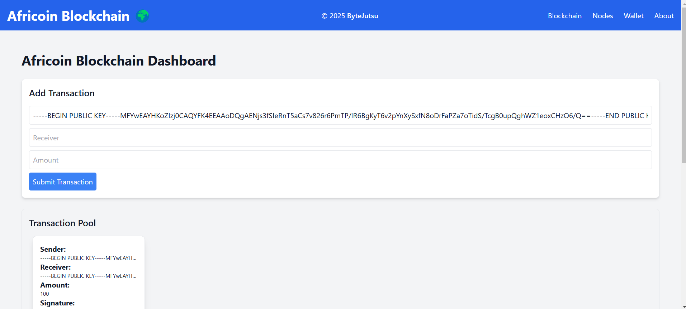
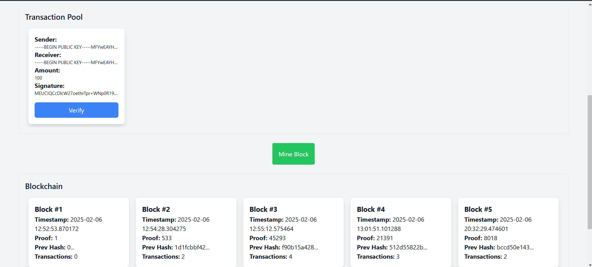
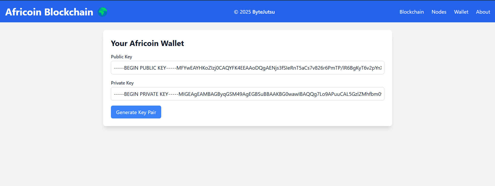
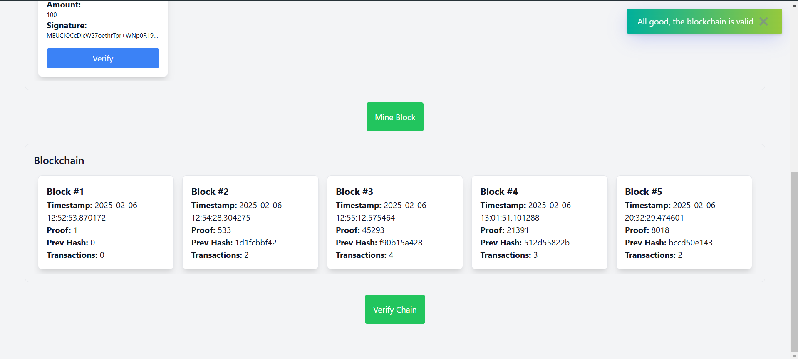

# Africoin - A Revolutionary Cryptocurrency for Africa

## About Africoin
Africoin is a revolutionary cryptocurrency built to serve the unique needs of African communities. It offers a secure blockchain, seamless transactions, and a user-friendly wallet.

🚀 Unlike traditional cryptocurrencies, Africoin is designed to be easily mined and transferred. It adapts to local infrastructure, making digital currency more accessible than ever.

👨‍💻 Developed as an MVP (Minimum Viable Product) by **Dhia Eddine Nabli**, Africoin is a testament to the potential of blockchain in Africa. The project was built under the **ByteJutsu** startup to showcase real-world use cases.

🌱 With Africoin, digital finance is no longer out of reach. It brings financial freedom to communities, enabling fast, secure, and inclusive transactions across the continent.

## Features
- ✅ Secure and transparent blockchain
- ✅ Easy and efficient mining
- ✅ Fast and seamless transactions
- ✅ User-friendly wallet interface
- ✅ Built to support local infrastructure

## Screenshots
Here are some screenshots showcasing Africoin:

1. Home Page:
   

2. Wallet Interface:
   

3. Transaction Page:
   

4. Mining Process:
   

5. Blockchain Overview:
   

## Meet the Developer
### Dhia Eddine Nabli
- **Founder & Developer**
- Passionate about innovation and blockchain technology
- Committed to making cryptocurrency accessible for African users

---
_Africoin - Empowering Africa through Blockchain_ 🚀

