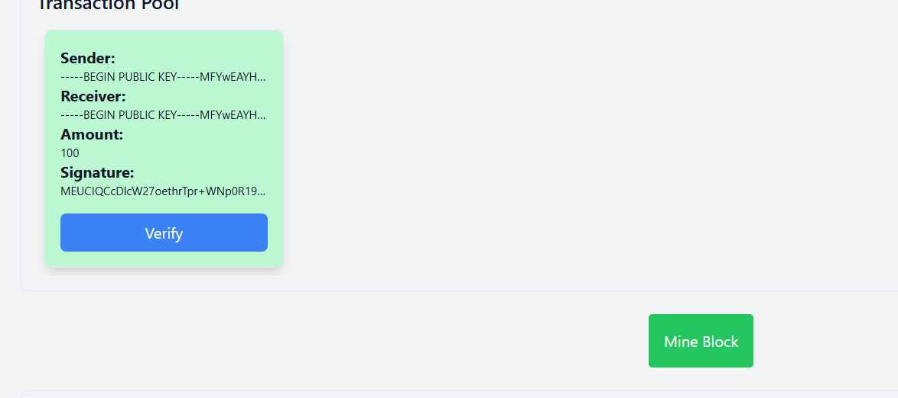
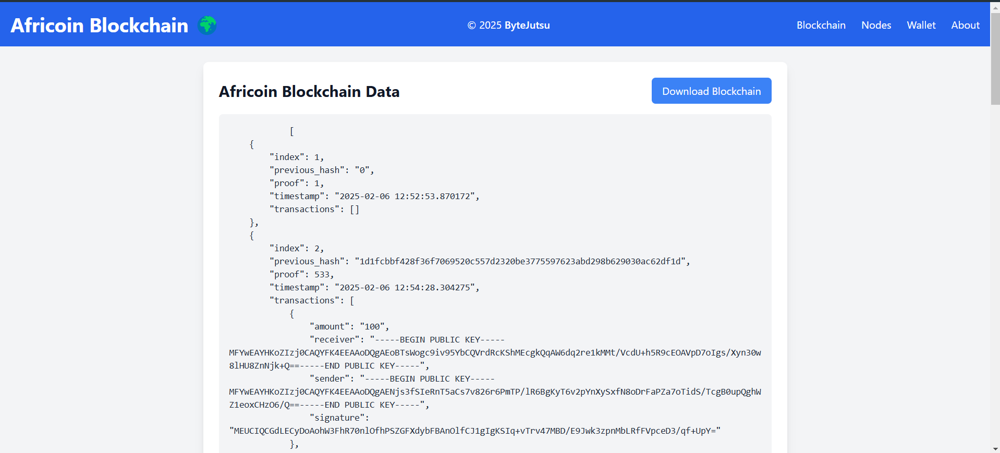

# Africoin - A Revolutionary Cryptocurrency for Africa

## About Africoin
Africoin is a revolutionary cryptocurrency built to serve the unique needs of African communities. It offers a secure blockchain, seamless transactions, and a user-friendly wallet.

🚀 Unlike traditional cryptocurrencies, Africoin is designed to be easily mined and transferred. It adapts to local infrastructure, making digital currency more accessible than ever.

👨‍💻 Developed as an MVP (Minimum Viable Product) by **Dhia Eddine Nabli**, Africoin is a testament to the potential of blockchain in Africa. The project was built under the **ByteJutsu** startup to showcase real-world use cases.

🌱 With Africoin, digital finance is no longer out of reach. It brings financial freedom to communities, enabling fast, secure, and inclusive transactions across the continent.

## Features
- ✅ Secure and transparent blockchain
- ✅ Easy and efficient mining
- ✅ Fast and seamless transactions
- ✅ User-friendly wallet interface
- ✅ Built to support local infrastructure

## Screenshots
Here are some screenshots showcasing Africoin:

1. Home Page:
   

2. Wallet Interface:
   

3. Transaction Page:
   

4. Mining Process:
   

5. Blockchain Overview:
   

## Meet the Developer
### Dhia Eddine Nabli
- **Founder & Developer**
- Passionate about innovation and blockchain technology
- Committed to making cryptocurrency accessible for African users

## Implementation Details
Africoin's blockchain is built and implemented entirely from scratch in Python, without relying on an existing blockchain network. This ensures full control over the protocol and optimizations tailored for African communities.

## Live Demo
The Africoin application is deployed and accessible for use through the following link:

🔗 [Africoin Live App](https://dnabli007.pythonanywhere.com/)

---
_Africoin - Empowering Africa through Blockchain_ 🚀

